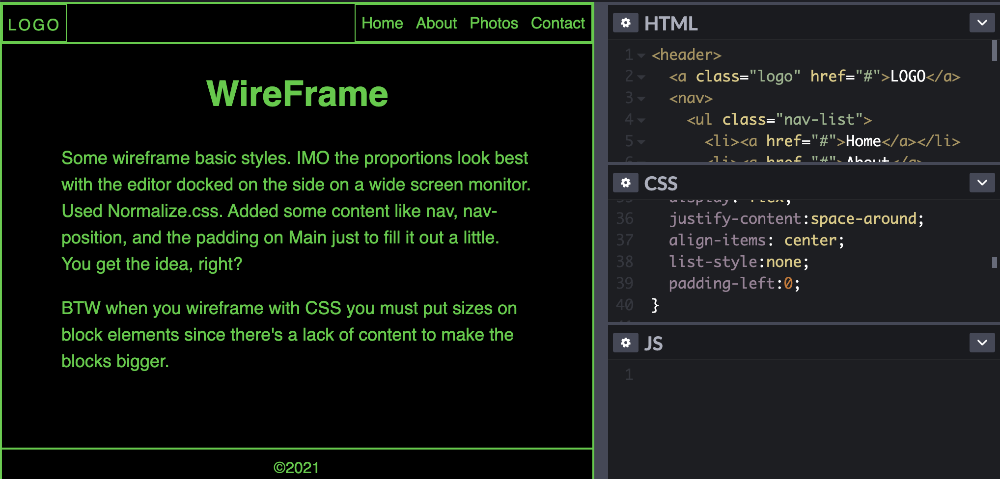

# wireframe
A simple outline style wireframe utility in HTML and CSS
Some wireframe basic styles. IMO the proportions look best with the codepen editor docked on the side on a wide screen monitor. didn't use a container to limit spread because it's just something quick to be seen in my prototyping environment. Used Normalize.css. Added some content like nav, nav-position, and the padding on Main just to fill it out a little. You get the idea, right?  
BTW when you wireframe with CSS you must put sizes on block elements since there's a lack of content to make the blocks bigger.  

